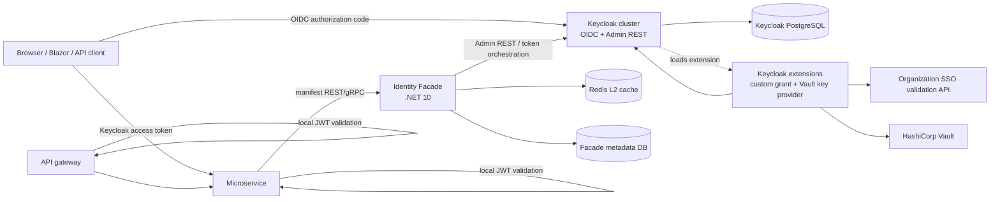
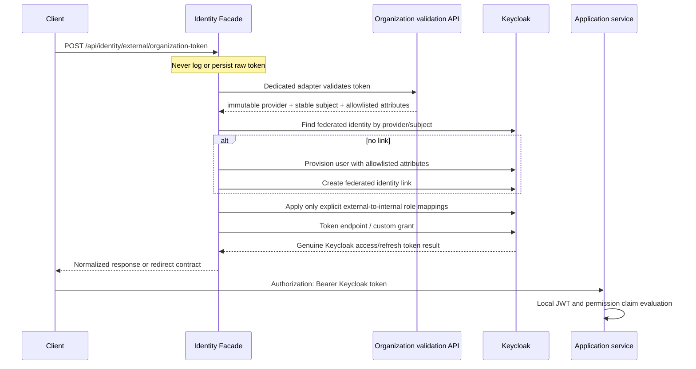

# Keycloak-Centric Identity Platform

## Decision summary

Keycloak is the authoritative Identity Provider and OAuth 2.0/OIDC Authorization Server. The .NET 10 application is an **Identity Facade / Identity Orchestrator**, not a second identity server.

The platform deliberately does **not** implement password hashing, credential verification, authentication sessions, access-token or refresh-token minting, refresh-token rotation, token revocation, MFA, password recovery, external identity storage, user federation, realm/client/composite role semantics, or JWT signing. Those capabilities remain in Keycloak.

Every access token accepted by an application service is a genuine Keycloak-issued token. The facade may validate, normalize, cache, provision, register, and administer; it never signs or exchanges a token in .NET.

## System architecture



### Ownership boundary

| Capability | Owner | .NET facade behavior |
|---|---|---|
| Users, usernames, immutable subject IDs | Keycloak | Directory adapter and normalized DTOs |
| Passwords, credentials, password policy/reset | Keycloak | Never read or persist credentials |
| Authentication sessions, MFA, federation | Keycloak | Start/coordinate supported Keycloak flows |
| Access and refresh tokens, revocation | Keycloak | Call Keycloak endpoints; never mint |
| Realm/client/composite roles | Keycloak | Register application-owned client roles and administer through constrained APIs |
| External identity links | Keycloak | Validate proprietary identity and ask Keycloak to create/update the link |
| JWT signing and JWKS | Keycloak | Consumer packages use Keycloak discovery/JWKS |
| Permission manifests and service ownership | Facade | Hash, persist history, audit, and synchronize client roles |
| Stable application DTOs and APIs | Facade | Hide Keycloak representations |
| External proprietary SSO validation | Facade adapter / Keycloak grant extension | Validate only; no token issuance in .NET |
| Cache, reconciliation, observability | Facade | Bounded, explicit stale-data policy |
| RSA key source of truth | Vault | Keycloak extension consumes Vault-backed key set |

## Request flows

### Standard OIDC login

1. The client uses authorization code + PKCE against Keycloak.
2. Keycloak performs authentication, MFA, federation, session creation, and consent according to the realm flow.
3. Keycloak returns a Keycloak access token and, where configured, refresh token.
4. The client calls services with the access token. `Company.Identity.Authentication` validates issuer, audience, signature, lifetime, not-before, token type, and algorithm locally.
5. `Company.Identity.Authorization` evaluates mapped Keycloak realm/client-role claims locally. No facade call is made per request.
6. A BFF may keep tokens server-side and use an HttpOnly session cookie, but the BFF delegates session/token ownership to Keycloak or a dedicated BFF session component; the facade does not recreate Keycloak sessions.

### Proprietary organization token

The raw external token is accepted only over TLS and is treated as a secret.



The immutable external subject is the primary key. Email is a display/contact attribute only and is never used for automatic account matching. A first-login race is handled with a unique Keycloak federated-identity constraint and a re-read after conflict. A link already attached to a different user is a hard conflict requiring administrator or verified account-link flow.

Only configured attributes (for example `preferred_username`, `given_name`, `family_name`, and a normalized display name) may be synchronized. Raw claims, arbitrary profile fields, and external roles are not copied by default.

### Standards-compliant signed JWT/OIDC token

Prefer native Keycloak mechanisms when the organization supplies a signed JWT/OIDC token with a trusted issuer, subject, audience, signature algorithm, and JWKS:

1. For browser/interactive use, configure Keycloak Identity Brokering. Keycloak validates the upstream provider, creates its own session, applies its mappers, and issues Keycloak tokens.
2. For non-interactive delegation, evaluate the JWT Authorization Grant support in the exact pinned Keycloak release. The grant must be enabled and tested against that release; it is not assumed from a generic OAuth label.
3. Do not use deprecated legacy external-to-internal Token Exchange as the default design.

The JWT grant can be useful for a short-lived delegated access token but may not create the browser login session expected by an application, may not provide a refresh token, and has strict issuer/audience/subject/lifetime/replay constraints. Identity Brokering is preferred when session creation, account linking, refresh-token policy, and MFA are required. The supported behavior is captured in the release compatibility matrix before production enablement.

### Proprietary opaque token options

| Option | Recommendation | Session / refresh behavior | Upgrade and operations |
|---|---|---|---|
| .NET validates then signs its own token | Reject | Creates a second issuer and second revocation/session system | Severe security and interoperability risk; violates ownership boundary |
| .NET validates then uses unsupported/admin token fabrication | Reject | Undefined and cannot safely create a Keycloak session | Fragile, privilege-heavy, breaks on upgrades |
| Identity Brokering | Use only when upstream supports a Keycloak-supported browser/OIDC flow | Good for interactive sessions; provider-dependent refresh behavior | Lowest custom-code risk |
| JWT Authorization Grant | Evaluate for standards-compliant signed JWTs | May not create a user session or issue refresh tokens; short lifetime is expected | Release-specific support and careful conformance testing |
| Legacy external Token Exchange | Not the default; migrate away where deprecated | Version/provider-dependent | Deprecated semantics and high upgrade risk |
| **Custom OAuth2 Grant Type SPI** | **Recommended for opaque proprietary tokens** | Extension can resolve a user, create a Keycloak user session, and let Keycloak token manager issue configured access/refresh tokens | One release-pinned Java extension, but preserves Keycloak ownership |

The custom grant is `urn:company:params:oauth:grant-type:organization-token`. It receives the external token, calls a dedicated organization adapter, enforces replay/rate-limit policy, resolves or provisions the Keycloak user, creates or reuses the Keycloak identity link, and invokes Keycloak's token/session services. It must not implement JWT signing or independently serialize tokens.

## Clean Architecture and project structure

```text
src/
  Identity.Domain/                    # manifest and facade-owned invariants only
  Identity.Application/               # use cases and provider-neutral ports
  Identity.Contracts/                 # Company-owned REST/gRPC DTOs
  Identity.Infrastructure/            # cross-cutting HTTP, resilience, audit
  Identity.Infrastructure.Keycloak/   # Admin REST/OIDC adapter; no types leak outward
  Identity.Infrastructure.ExternalSso/ # organization validation adapter
  Identity.Infrastructure.Redis/      # L1/L2 cache implementation
  Identity.Api/                       # facade REST composition root
  Company.Identity.Abstractions/      # stable package contracts and attributes
  Company.Identity.Authentication/    # JWT validation options only
  Company.Identity.Authorization/     # policy primitives only
  Company.Identity.PermissionRegistration/ # discovery, hash, retry, client
  Company.Identity.Context/            # current-user abstraction and adapters
  Company.Identity.Grpc/              # normalized transport contracts
  Company.Identity.Blazor/             # optional BFF/UI helpers
  Company.Identity.Testing/            # test token/claims and fake ports

keycloak/
  extensions/organization-grant/      # release-pinned OAuth2 Grant Type SPI
  extensions/vault-key-provider/       # release-pinned Vault-backed key provider
  test/                                # compatibility and Testcontainers tests
```

`Identity.Application` and `Identity.Domain` depend only on `Identity.Contracts` where appropriate and provider-neutral ports. They do not depend on Keycloak SDKs, Admin REST representations, EF Core, ASP.NET Core, Redis, RabbitMQ, or gRPC implementation details.

Facade persistence is optional and contains only:

- manifest history, canonical hash, accepted version, and deprecation state;
- external synchronization metadata that is not the identity link itself;
- application configuration, reconciliation cursors, authorization-version metadata;
- audit/event metadata and operational status.

There is no second `Users`, `PasswordCredentials`, `Sessions`, `RefreshTokens`, `SigningKeys`, or duplicated role database.

## Keycloak configuration model

Use a version-pinned realm and import/configuration reviewed as code.

- One client per microservice where practical, such as `order-service`.
- Permissions are stable realm role names: `Orders.Read`, `Orders.Create`, `Orders.Update`, and `Orders.Cancel`. The realm's `permissions-mapper` client scope maps realm roles into the `permissions`/`permission` token claims.
- Business roles are realm roles with composites that include the appropriate permission roles, for example `OrderManager` includes `Orders.Cancel`.
- Configure audience and role mappers so tokens contain only the roles needed by the target services. Do not place unbounded profile data or an unnecessarily large permission list in tokens.
- The facade has a confidential service account with only the Admin REST permissions required for directory queries and constrained role/client management.
- Each registering microservice has a distinct client credential or mTLS identity. It can manage only its own client and permission namespace.
- Human administrators use the Keycloak Admin Console for identity operations. Facade-managed role/permission writes are preferred so cache invalidation and audit are reliable.
- Configure short-lived access tokens for normal APIs. Refresh-token policy remains Keycloak-owned.

### Client roles versus Authorization Services

Client roles + composites are the default because they are simple, interoperable in JWTs, naturally owned by a microservice, easy to enforce with local ASP.NET policies, and easy to register idempotently. Keycloak Authorization Services resources/scopes are reserved for object-level, resource-instance, or highly dynamic decisions where an entitlement/policy request is worth the extra network dependency and operational complexity. They are not used merely to represent static endpoint permissions.

## Identity Facade APIs

All responses use application-owned DTOs with stable identifiers and pagination; Keycloak representation types are internal.

```text
GET  /api/identity/users?search=&page=&pageSize=
GET  /api/identity/users/{id}
GET  /api/identity/roles?clientId=&page=&pageSize=
GET  /api/identity/roles/{id}
GET  /api/identity/permissions?serviceId=&includeDeprecated=
GET  /api/identity/users/{id}/roles
GET  /api/identity/users/{id}/permissions
POST /api/identity/permissions/register
POST /api/identity/external/organization-token
```

`POST /api/identity/permissions/register` requires the `Identity.Permissions.Register` permission. The facade derives the authenticated service ID from the validated credential (`client_id`/`azp` claim), compares it to `manifest.serviceId`, and records the manifest. Administrative user/role APIs require separate administrator permissions (`Identity.Users.Read`, `Identity.Roles.Read`, `Identity.Keys.*`) and are not exposed to ordinary service clients. The full REST surface is browsable and callable in Scalar at `/scalar` (Development) or via `/openapi/v1.json`.

Equivalent gRPC operations use the same DTO semantics and authorization. Error responses contain a correlation ID, not secret material.

## Permission registration protocol

A service declares permissions close to its endpoint or application method:

```csharp
[RequirePermission("Orders.Cancel")]
public async Task<IActionResult> Cancel(CancellationToken cancellationToken) { /* ... */ }
```

`Company.Identity.PermissionRegistration` discovers attributes, endpoint metadata, gRPC metadata, explicit definitions, or optional source-generator output. It produces canonical JSON with sorted permission names and stable fields:

```json
{
  "serviceId": "order-service",
  "serviceVersion": "3.2.1",
  "manifestVersion": "18",
  "permissions": [
    { "name": "Orders.Cancel", "description": "Allows cancelling orders" },
    { "name": "Orders.Read", "description": "Allows reading orders" }
  ],
  "manifestHash": "sha256:..."
}
```

The hash is SHA-256 over deterministic UTF-8 JSON (ordinal field/name ordering, normalized strings, no timestamps). A registration includes the hash, correlation ID, and idempotency key. It is sent directly over REST by default or gRPC when required. No RabbitMQ exchange, queue, outbox, or consumer is involved.

The identity facade:

1. authenticates the service;
2. validates service ID, namespace, count/length limits, manifest version, and hash;
3. inserts or updates the permission catalog idempotently;
4. creates/gets each permission as a Keycloak **realm role** (best-effort, conflict-aware — an already-existing role is success, and a Keycloak outage never fails the response); the realm's `oidc-usermodel-realm-role-mapper` then surfaces the role in the `permissions`/`permission` token claims;
5. marks permissions missing from a newer accepted manifest as deprecated, never deletes them automatically — and never removes the Keycloak role;
6. invalidates L1/L2 catalogs and increments authorization version;
7. records audit data without raw tokens or secrets.

Database uniqueness and Keycloak conflict-aware create/get logic make concurrent replicas safe. Registration is retried by a hosted worker with bounded exponential backoff and jitter. Failure does not fail application startup; the service remains available and exposes registration health/lag metrics.

## NuGet integration

The intended consuming-service experience is:

```csharp
builder.Services
    .AddCompanyAuthentication(options =>
    {
        options.Authority = configuration["Identity:Authority"]!;
        options.Audience = configuration["Identity:Audience"]!;
    })
    .AddCompanyAuthorization();

builder.Services.AddPermissionRegistration(options =>
{
    options.IdentityServer = new Uri(configuration["PermissionRegistration:IdentityServer"]!);
    options.ServiceName = "order-service";
    options.KeycloakBaseUrl = "http://localhost:8080";
    options.KeycloakClientId = "order-service";
    options.KeycloakClientSecret = configuration["PermissionRegistration:KeycloakClientSecret"];
});
```

A runnable reference consumer with ten permission-guarded endpoints is in [samples/OrderService.Sample](../samples/OrderService.Sample/); its tests are in [tests/Identity.Sample.Tests](../tests/Identity.Sample.Tests/).

Then an endpoint needs only:

```csharp
[RequirePermission("Orders.Cancel")]
```

Package boundaries are intentionally independent:

- `Company.Identity.Abstractions`: attributes, claim names, stable DTO primitives.
- `Company.Identity.Authentication`: JWT bearer validation only; no authorization or registration dependency.
- `Company.Identity.Authorization`: authorization requirements and local claim evaluation; no authentication dependency.
- `Company.Identity.PermissionRegistration`: discovery, canonical hash, service credentials, direct REST/gRPC registration, startup retry.
- `Company.Identity.Context`: `ICurrentUserContext` and HTTP/gRPC adapters.
- `Company.Identity.Grpc`: generated/normalized client contracts.
- `Company.Identity.Blazor`: optional BFF/browser helpers.
- `Company.Identity.Testing`: deterministic claims, fake clocks, test handlers.

Authentication uses ASP.NET `JwtBearer` and OIDC `ConfigurationManager` to cache discovery and JWKS. It validates issuer, audience, signature, expiration, not-before, accepted algorithm, and token type. An unknown `kid` triggers metadata refresh, then fails closed if the key remains unknown. It does not call the facade or Keycloak on every request and does not cache signature results in Redis.

## Current-user context

```csharp
public interface ICurrentUserContext
{
    string? UserId { get; }
    string? Username { get; }
    IReadOnlyCollection<string> Roles { get; }
    IReadOnlyCollection<string> Permissions { get; }
    IReadOnlyDictionary<string, string?> Claims { get; }
    string? SessionId { get; }
    DateTimeOffset RequestDateTime { get; }
}
```

The application layer consumes this abstraction. HTTP and gRPC adapters translate the transport principal. `TimeProvider` is injected for deterministic tests. Application code does not depend on `IHttpContextAccessor`.

## Caching and authorization consistency

Use cache-aside L1 process memory + L2 Redis for facade data:

| Data | Starting TTL | Invalidation / stale behavior |
|---|---:|---|
| Keycloak admin user directory | 60 seconds | Invalidate after facade write; bounded stale reads during outage |
| Role and permission catalogs | 60 seconds | Invalidate after registration/admin write; reconcile periodically |
| Effective authorization snapshots | 30 seconds | Version-keyed; security-sensitive operations can require live check |
| Manifest status/history | 5 minutes | Invalidate on registration; stale status is observable |
| OIDC discovery/JWKS | OIDC `ConfigurationManager` policy | Refresh on expiry/unknown `kid`; not Redis signature caching |

Redis is not a source of truth. L1 failures fall through to Redis, Redis failures fall through to Keycloak for safe read paths, and security-sensitive writes fail closed. A bounded stale response must expose age and never be silently indefinite. All serializers carry a versioned cache envelope.

Stateless local JWT validation, immediate permission/session revocation, and zero network calls cannot all be guaranteed. The default is short access-token lifetimes plus local validation. For sensitive operations, choose one of:

- a `authorization_version` claim checked against a short-TTL distributed version cache;
- live Keycloak introspection/session validation;
- a facade policy check with fail-closed behavior;
- a shorter token lifetime for the specific client.

Each option trades availability and latency for a smaller revocation window. A role/permission write through the facade increments the version and invalidates caches. If direct Admin Console writes are allowed, use short TTLs plus periodic reconciliation and, where supported by the pinned Keycloak release, a minimal Keycloak Event Listener to publish invalidation signals. Never claim perfect immediate revocation with a self-contained JWT.

## Vault-backed RSA signing

Keycloak signs JWTs with asymmetric RSA keys. The .NET facade never owns a signing key and has no application JWKS endpoint. Modern Keycloak should not be assumed to include native HashiCorp Vault integration.

Implement two release-pinned Keycloak extensions:

```text
Vault Integration / VaultProvider SPI
    reads active pointer, key metadata, and material or signing capability
                |
                v
Vault-backed KeyProvider SPI
    exposes immutable kid + active signer + passive verification keys
                |
                v
Keycloak realm key provider
                |
                v
Keycloak JWT signing and JWKS
```

Vault is the source of truth. Vault paths contain immutable RSA key versions and an activation pointer. Private material is never logged and is not persisted outside Vault unnecessarily. The initial design loads private material into protected Keycloak process memory because it is substantially simpler and compatible with Keycloak's normal signer lifecycle. Vault Transit/HSM-like remote signing is an advanced option: it avoids export but requires a custom Keycloak signing integration, network latency/error policy, cryptographic interface testing, and a larger upgrade surface.

Vault ACLs are least privilege: Keycloak can read only the exact key metadata/material or transit operation needed; it cannot list unrelated secrets or write activation data unless the rotation controller is intentionally colocated.

### Rotation

1. Generate/import a new RSA key in Vault with a unique ID such as `iam-rsa-2026-09`; never replace material under an existing `kid`.
2. Atomically advance the Vault active pointer and version.
3. Each Keycloak replica observes the pointer, loads the new key, and converges before readiness reports healthy.
4. New tokens use the new `kid`. The old key becomes passive verification-only.
5. JWKS continues to expose old and new public keys while old tokens may be valid.
6. Remove the old key only after the maximum relevant access-token/session lifetime plus clock skew and operational safety margin.

A running node may use its last-known-good loaded key for a bounded, alerted outage window. A new node with no valid key set fails readiness/startup and must not generate an unrelated key. Health checks alert on Vault reachability, active-key age, replica convergence, JWKS completeness, and rotation lag. Consumers automatically refresh JWKS on an unknown `kid`.

## Failure scenarios

| Failure | Expected behavior |
|---|---|
| Keycloak unavailable | Local JWT validation continues until token expiry; facade writes fail closed; bounded stale catalog reads may continue |
| Facade unavailable during service startup | Service starts; manifest worker retries with jitter |
| Redis unavailable | L1 and origin fallback for safe reads; writes record invalidation failure and alert |
| Organization validation API unavailable | External-token flow fails closed; token is not stored for retry |
| Invalid/replayed external token | Reject, rate-limit, audit metadata only; never provision |
| Keycloak Admin conflict during provisioning | Re-read by immutable provider/subject; never match by email |
| Vault outage on running node | Last-known-good bounded policy; alert and stop risky key changes |
| Vault outage on new Keycloak node | Fail readiness; never create a local unrelated signing key |
| Unknown JWT `kid` | Consumer refreshes discovery/JWKS once, then rejects if still unknown |
| Manifest missing permissions | Mark deprecated; retain role and history; administrator controls deletion |
| Direct Admin Console role change | Short TTL/reconciliation/event listener closes cache gap; audit source is distinguished |

## Threat model and controls

| Threat | Controls and residual risk |
|---|---|
| External-token replay/theft | TLS, no logging/persistence, provider replay/nonce/expiry checks, rate limits, one-time use where supported; a stolen still-valid opaque token remains a provider risk |
| Account linking attack | Immutable provider+subject key, no email matching, explicit authenticated linking, conflict rejection, step-up verification |
| Email-based takeover | Email is not identity key and cannot auto-link accounts |
| Privilege escalation from external claims | Allowlisted attributes only; external roles ignored unless explicit mapping; privileged mappings audited |
| Malicious permission registration | Keycloak client credentials/mTLS, service-ID equality, namespace ownership, least privilege, manifest limits, audit |
| Compromised microservice credential | Credential scoped to one client; rotation, mTLS, revocation, registration rate limits |
| JWT theft | TLS, short lifetime, audience restriction, secure storage/BFF; bearer theft remains valid until expiry unless live checks are used |
| Stale authorization | Short TTL/version checks/reconciliation/live checks for sensitive operations; no false claim of immediate revocation |
| Compromised RSA keys | Vault ACLs, unique kids, rotation/overlap, alerts, incident revocation/runbook; key compromise requires emergency realm-key response |
| Vault compromise | Least privilege, audit, network isolation, Transit/HSM option, immutable versions |
| Vault outage | Last-known-good bounded use for running nodes; new nodes fail safe |
| Keycloak compromise | Separate admin/service accounts, realm isolation, network policy, backups, alerting, incident response |
| Admin API exposure | Private network, TLS/mTLS, allowlisted routes, scopes, rate limits, no public Admin REST |
| Secret leakage | Redaction tests and structured logging policy; never log passwords, access/refresh/external tokens, private keys, or Vault secrets |

## Testing strategy

Unit tests cover stable-subject validation, invalid tokens, allowlisted synchronization, no-email-linking, provisioning/link conflicts, duplicate identity prevention, explicit role mapping, canonical manifest/hash, namespace authorization, duplicate/concurrent registration, deprecation, bounded retry, current-user adapters, and cache stale/fail-closed behavior.

Integration tests use Testcontainers for the pinned Keycloak, PostgreSQL, Redis, and a stub organization validation API. They verify real Keycloak access/refresh issuance, Admin REST DTO normalization, federated links, provisioning races, role composites, local JWT validation, discovery/JWKS caching, unknown-`kid` refresh, cache invalidation, and facade downtime during startup.

The grant and Vault key-provider extensions have their own compatibility suite for invalid/replayed tokens, rate limiting, session creation, refresh behavior, account conflicts, Vault version detection, key rotation, old-token validation, outage/LKG behavior, and multi-node convergence. CI tests the pinned Keycloak release and the next supported release before upgrades.

## Deployment model

Development Compose includes Keycloak, Keycloak PostgreSQL, the facade, optional facade metadata PostgreSQL, Redis, and optional Vault dev mode. RabbitMQ and local signing-key volumes are intentionally absent. Production uses managed/highly available Keycloak and PostgreSQL, Redis with TLS/authentication, Vault with HA/seal management, private networking, TLS everywhere, secret injection, backups, restore drills, separate service accounts, and readiness checks for dependencies.

Keycloak extensions are built and scanned as release-specific artifacts, deployed to every Keycloak replica before configuration activation, and rolled out with compatibility/readiness checks. Facade replicas are stateless except for the metadata store and L1 cache. Metrics include token/Keycloak call latency, Admin API failures, manifest lag/hash conflicts, cache age/invalidation failures, external validation failures, Vault connectivity, key convergence, and rejected namespace/role attempts.

The repository's old local identity database, `identity-signing-keys.json`, RabbitMQ topology, local bootstrap credentials, local JWKS endpoint, and custom token/session code are not production components of this architecture. They must be removed from deployment and runtime composition, not renamed and retained as a second source of truth.
