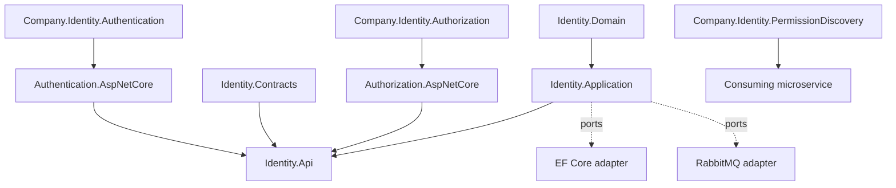

# Architecture

The domain contains identity aggregates and security invariants. Application exposes use cases and ports. Infrastructure adapters implement external concerns. The API and gRPC layers translate transport contracts into application requests. `Company.Identity.Authentication` is intentionally independent from `Company.Identity.Authorization`, allowing a gateway to validate tokens without installing permission discovery.

The next implementation phases add persistence, key management, refresh-token lifecycle, provider adapters, RabbitMQ outbox/consumer handling, gRPC, BFF sessions, admin APIs, observability, Docker, and Testcontainers integration tests.
