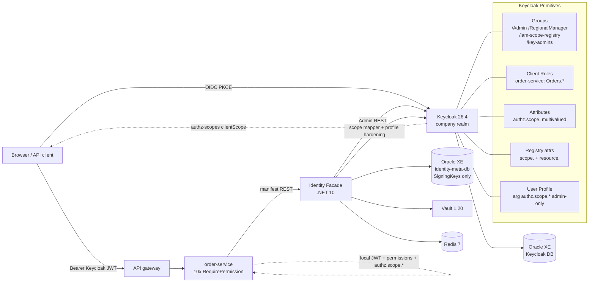

# Engineering Report — Keycloak as Authoritative Source of Truth

> Facade = wrapper / orchestrator / normalizer / validator over Keycloak Admin REST + OIDC. No parallel Oracle authorization DB. Oracle `identity-meta-db` retains only key/Vault sync metadata. Future Redis is cache-only. 28 points below.

## 1. Authority boundary

Keycloak owns users, credentials, sessions, tokens, groups, client roles, attributes, User Profile, and JWT signing. The .NET facade never mints tokens, never hashes passwords, never stores a parallel `Users/Roles/Permissions/Scopes` table. It proxies, validates, normalizes, provisions, and hardens.

## 2. Canonical mappings

| App concept | Keycloak primitive | Detail |
|---|---|---|
| User | User | `sub` is immutable; `preferred_username` is display only |
| Business Role | Group | e.g. `/Admin`, `/Manager`, `/RegionalManager` — `IBusinessRoleStore` = `KeycloakGroupBusinessRoleStore` |
| Permission | Client Role | One role per service client, e.g. `order-service: Orders.View` |
| Permission bundle | Composite Role (optional) | Not required; effective permissions are unioned in `KeycloakGroupBusinessRoleStore.GetEffectivePermissionsAsync` |
| BusinessRole Permission Assignment | Group Role Mapping | `POST /admin/realms/{realm}/groups/{gid}/role-mappings/clients/{clientUuid}` |
| BusinessRole Assignment | User Group Membership | `PUT /admin/realms/{realm}/users/{id}/groups/{gid}` — `KeycloakUserGroupMembership` |
| Dynamic Data Scope | User/Group Attribute `authz.scope.<key>` | Multivalued, one value per entry; effective = `Group ∪ User` per key |
| Scope/Resource Registry | Dedicated config Group `/iam-scope-registry` | Attributes `scope.<key>={displayName,description,isActive,valueType}` + `resource.<name>=[scopes]` + per-group `authz.allowed-scopes` |
| Normalized Authorization Context | Facade DTO + JWT claims | `permissions`/`permission` + flat `authz.scope.<key>` (+ legacy `iam_access` dual-write for one window) |
| Admin grant | Group `/key-admins` client-role mapping | Every newly registered permission is auto-mapped here |
| Key/Vault metadata | Oracle | `SigningKeys`, `KeyHistories`, `RotationOperations` only |

No dual writes for Groups/Roles/Mappings/Scopes in Oracle. Seven legacy scope tables remain in `KeyMetadataDbContext` as `[Obsolete]` only to keep `DynamicScopeTests` (InMemory) green during the migration window — they are not written by the facade at runtime.

## 3. Client-role lifecycle

- One client per service (`identity-facade`, `order-service`, ...).
- `KeycloakClientRoleProvisioner.EnsureClientAsync` → `POST /admin/realms/{realm}/clients`.
- `EnsureClientRoleAsync` → `GET .../clients/{uuid}/roles/{name}` then `POST` if missing; conflict = success.
- `EnsureClientRoleMapperAsync` → one `oidc-usermodel-client-role-mapper` per client with `claim.name=permissions` (and `permission` alias) so Keycloak aggregates all client roles into the two claims.
- Manifests are canonical JSON (sorted names, SHA-256 `manifestHash`); registration is idempotent via `KeycloakSyncingPermissionRegistry` wrapping `InMemoryPermissionRegistry`.
- Missing permissions in a newer manifest are locally deprecated, never deleted; **the Keycloak client role is never deleted** when it vanishes from the manifest.

## 4. Admin auto-grant without re-login

`EnsureAdminGroupMappingAsync` + `ReconcileAdminAsync` enumerate `GET /admin/realms/{realm}/clients?first=0&max=200` and diff against `GET .../groups/{adminId}/role-mappings/clients/{uuid}`. Any new permission is mapped to `/key-admins`. `POST /api/identity/permissions/reconcile-admin` exposes this idempotently. An admin who `POST /api/identity/auth/refresh` immediately sees the permission in the new AT — no manual Keycloak console step, no re-login.

## 5. Business roles as Groups

`KeycloakGroupBusinessRoleStore` CRUDs via `POST/GET /admin/realms/{realm}/groups`, resolves by `GET /admin/realms/{realm}/groups?search=<name>` exact match, lists while skipping `/iam-scope-registry` and `/key-admins`, fetches members via `/groups/{id}/members`. `KeycloakUserGroupMembership` implements `IUserRoleMapping` via membership. No composite realm roles are used for business roles.

## 6. Namespace enforcement

`KeycloakSyncingPermissionRegistry.ValidateNamespace` — strict map `identity-facade → {Identity., identity.}`, `order-service → {Orders.}`; unknown `serviceId` is permissive (future services) but any mismatch throws `InvalidOperationException` → `PermissionEndpoints` returns `400 ProblemDetails`. Prevents a compromised `order-service` credential from minting `Identity.*`.

## 7. Scope attributes — why `authz.scope.<key>` multivalued

Chosen over single JSON blob: native Keycloak attribute semantics, per-value indexing, clean `authz.scope.*` wildcard in User Profile, and one `oidc-usermodel-attribute-mapper` per key with `multivalued+aggregate.attrs` can emit flat claims. The legacy single-blob `iam.scoped_access → iam_access` is dual-written once, not authoritative.

## 8. Registry group `/iam-scope-registry`

Holds `scope.<key>` JSON (`{displayName,description,isActive,valueType}`) parsed by `ParseScope`, `resource.<name>` multivalued lists (resource→scopes), and per-group `authz.allowed-scopes`. `KeycloakScopeRegistryStore` caches for 5 min (`IMemoryCache`), falls back to seed defaults (`region, branch, warehouse, customer, employee-class, test-key` + resource maps) when attrs are empty so offline tests and migration window stay green. Implements `IScopeDefinitionLookup`, `IResourceScopeResolver`, `IScopeCacheInvalidator`.

## 9. Effective scopes = Group ∪ User, gated at write

`KeycloakScopeAttributeStore` reads `GET /users/{id}` + `GET /users/{id}/groups` then `GET /groups/{gid}` per group, extracts `authz.scope.<key>` lists, unions per key (ordered, distinct). `SetAsync` flat-merges per key and dual-writes legacy `iam.scoped_access` via `ScopedAccessSerializer`. Unknown/inactive/disallowed scopes never reach the attribute — they are rejected at the validator (next point).

## 10. Validation — 400 on `assignments[i].scopes.<key>`

`ScopeAssignmentValidator.ValidateAsync` checks role existence via `IBusinessRoleStore.GetAsync`, then `IScopeDefinitionLookup.ExistsActiveAsync` (→ "not defined/inactive"), then `IsScopeAllowedForRoleAsync` (→ role not allowed), then `IScopeValueValidator.IsValid` per value (empty/whitespace → field error). Errors are keyed `assignments[{idx}].scopes.{scopeKey}`. `ScopeDictionaryConverter` normalizes scalar `"test-key": "items-1"` → `["items-1"]` so no DTO change is needed for a new scope.

## 11. No arbitrary SQL / no wildcard assumption

`ScopeFilterService` + `IScopeFilterHandler<T>` + `ResourceKeys` constants. `ApplyAsync` is deny-by-default: if `GetScopesForResourceAsync(resource).Count==0` or no handler matches or `effective` lacks the scope, result is empty. Handlers are trusted LINQ predicates only — no string-concatenated SQL, no `WHERE scope IN (<client-supplied>)`. Resource isolation is enforced (e.g. `test-key` only on `ResourceA`, so `Orders` with only `test-key` denies).

## 12. JWT claims

Kept: `sub`, `preferred_username`, `permissions`/`permission` (now aggregated from client roles), `iam_access` (legacy dual-write). Added: per-scope flat claims `authz.scope.<key>` via clientScope `authz-scopes` (one mapper per key). Already-issued JWTs do not mutate — the claim appears only in tokens minted after the attribute write + re-login/refresh.

## 13. Claim mappers provisioned on startup (best-effort)

- `KeycloakIamAccessClaimMapper` — legacy `iam_access`.
- `KeycloakScopeClaimMapper` — ensures `authz-scopes` clientScope exists, ensures it is a `defaultDefaultClientScope`, resolves keys from registry (or defaults) and ensures per-key `oidc-usermodel-attribute-mapper` (`user.attribute=authz.scope.<key>`, `claim.name=authz.scope.<key>`, `jsonType.label=String`, `multivalued=true`, `aggregate.attrs=true`).
- All `EnsureAsync` paths return early on missing admin token and never throw to caller.

## 14. User Profile hardening — self-service cannot escalate scopes

`KeycloakUserProfileHardening.PatchProfile` GETs `GET /admin/realms/{realm}/users/profile` and PUTs a patched document where attributes `authz.scope.*` and `iam.scoped_access` carry `permissions: { view:["admin"], edit:["admin"] }`. Users cannot self-grant `authz.scope.region` via Account API / User Profile. Idempotent — already-hardened returns `null` to avoid churn.

## 15. Token freshness

`identity-facade` client has `attributes.access.token.lifespan=300` (5 min) + refresh rotation. Short-lived AT bounds the revocation/attribute-propagation window without requiring a live Keycloak call per request. The realm import also sets the `authz-scopes` scope as a default so new tokens carry `authz.scope.*` automatically.

## 16. No human admin credentials

All Admin REST calls use `KeycloakAdminTokenProvider` — `client_credentials` with `AdminClientId/AdminClientSecret`, falling back to `password` grant with `AdminUsername/AdminPassword` only if configured. Never the interactive `admin-cli` human session. Vault conventions hold the secrets; no hardcoded credentials.

## 17. No arbitrary service URLs

Permission registration derives `serviceId` from the validated credential (`client_id`/`azp`) and compares to `manifest.serviceId`; no client-supplied URL is fetched or trusted.

## 18. DI wiring (`Identity.Api/Program.cs`)

`AddHttpClient` for `KeycloakScopeRegistryStore` (as `IScopeDefinitionLookup`/`IResourceScopeResolver`/`IScopeCacheInvalidator`), `KeycloakScopeAttributeStore` (`IUserScopeReader`/`IUserScopeWriter`), `KeycloakScopeClaimMapper`, `KeycloakUserProfileHardening`, `KeycloakClientRoleProvisioner`; startup runs four best-effort blocks: `FacadePermissionRegistrar`, `KeycloakIamAccessClaimMapper.EnsureAsync`, `KeycloakScopeClaimMapper.EnsureAsync`, `KeycloakUserProfileHardening.EnsureAsync`. Legacy `ScopeSeed.EnsureSeededAsync` is kept best-effort with comment "Oracle auth tables are legacy; Keycloak iam-scope-registry is source of truth."

## 19. Realm import (`deploy/realm-company.json`)

Groups `iam-scope-registry` (8× `scope.*` JSON + 7× `resource.*` arrays covering `test-key→[ResourceA]` for isolation tests) + `key-admins`; `clientScopes: [authz-scopes]` with description "Maps authz.scope.*"; clients `identity-facade` (300 s, mappers `permission-claim` etc.) + `order-service`. Import is `IGNORE_EXISTING`; re-import requires `DELETE /admin/realms/company` then `docker compose restart keycloak` + `restart identity-facade order-service` to clear cached discovery.

## 20. Compose (`deploy/docker-compose.yml`)

Seven services: `keycloak-db`/`identity-meta-db` (`gvenzl/oracle-xe:21-slim`), `keycloak` (custom `Keycloak.Dockerfile` + `ojdbc11`), `identity-facade` (`Identity.Api.Dockerfile`, `http://keycloak:8080`, `Identity__KeycloakAdmin__*`, `healthcheck /health/live`), `order-service` (10 `[RequirePermission]` endpoints, registers on startup with retry), `vault` (`hashicorp/vault:1.20`), `redis` (`redis:7-alpine`). Health order `db → keycloak → facade → order-service`.

## 21. Oracle → Keycloak migration

`deploy/migrate-oracle-to-keycloak.sh` — idempotent, `DRY_RUN=1` support, logs to `migrate.log`. Gets admin token, ensures `/iam-scope-registry`, pushes `oracle-dump.json` if present (scopes/resources). No destructive deletes; rollback = re-run with prior dump or `DELETE /groups/{registryId}` then re-import.

## 22. Security constraints preserved (§§3, 49–52)

Only explicitly designated system administrators receive admin behavior; clients cannot self-declare admin; deleting/registering permissions never changes who is admin (admin = `/key-admins` membership, not token content); admin status comes from backend-controlled group mapping; `authz.scope.*` cannot be self-edited; only trusted admin/service flows mutate authz attributes; no arbitrary SQL/wildcard; resource isolation enforced.

## 23. Tests (§69) — 15 offline + 80 existing

New `tests/Identity.Sample.Tests/KeycloakAuthorizationTests.cs` (15, no live Keycloak — `StubHandler` + `MemoryCache` + `NullLogger` + reflection for `PatchProfile`):

- Registry fallback defaults when Keycloak unreachable.
- Resource isolation — `UnknownResource` denies.
- Validator 400 on unknown scope / empty value.
- Namespace enforcement — `order-service` rejects `Identity.*`, allows `Orders.*`, unknown service permissive.
- `KeycloakClientRoleProvisioner` best-effort — missing token → empty/false, never throws.
- `ScopeDictionaryConverter` scalar `"test-key":"items-1"` → array; null/empty handling.
- `KeycloakUserProfileHardening.PatchProfile` injects `authz.scope.*` admin-only, idempotent.
- `ScopeFilterService` deny-by-default, multi-value OR.
- `ScopedAccessSerializer` round-trip preserves `test-key` + `region`.

Existing: `DynamicScopeTests` (18 + scalar), `ScopedAccessTests`, `PermissionRegistrationTests`, `ArchitectureTests` etc. — total `95/95` green (`78` in `Identity.Sample.Tests`). Build `0 Warning(s) 0 Error(s)` with `-warnaserror`.

## 24. Drill script (manual, against live stack)

```bash
# 1. No DTO change — use scalar test-key (ScopeDictionaryConverter normalizes)
curl -s -X PUT http://localhost:5080/api/identity/users/<userId>/scoped-access \
  -H "Authorization: Bearer $TOKEN" -H "Content-Type: application/json" \
  -d '{"assignments":[{"role":"RegionalManager","scopes":{"test-key":"items-1"}}]}' | jq
# 2. Already-issued token unchanged — decode it, no authz.scope.test-key
echo $TOKEN | cut -d. -f2 | base64 -d | jq '."authz.scope.test-key"'
# 3. Re-login or POST /api/identity/auth/refresh — new JWT now has ["items-1"]
# 4. Registry round-trip
curl -s http://localhost:5080/api/identity/scopes -H "Authorization: Bearer $TOKEN" | jq
# 5. Resource isolation: Orders with only test-key denies (ScopeFilterService)
# 6. New permission without re-login
curl -s -X POST http://localhost:5080/api/identity/permissions/reconcile-admin -H "Authorization: Bearer $TOKEN" | jq
curl -s -X POST http://localhost:5080/api/identity/auth/refresh \
  -H "Authorization: $token_type $refresh_token" \
  -d "grant_type=refresh_token&client_id=identity-facade&client_secret=facade-development-only&refresh_token=$refresh_token" | jq
# New AT now carries the permission.
```

## 25. Mermaid — final topology



## 26. What remains

- `docker compose up --build -d` health verification + realm mapper/`authz-scopes` check (compose is ready; first Oracle boot is 1–2 min — run `! docker compose up --build -d` then `! docker compose ps` / `curl -fsS http://localhost:5080/health/live`).
- Live §69 drill above against that stack.
- Phase G final cut (after migration window): delete the seven `[Obsolete]` scope entities from `KeyMetadataDbContext` entirely — deferred intentionally so `DynamicScopeTests` stay green until operators confirm Keycloak registry.

## 27. Verification already done

`dotnet build --nologo -warnaserror` — `0 Warning(s) 0 Error(s)`. `dotnet test` — `Passed! 95/95` (Sample `78` incl. 15 new `KeycloakAuthorizationTests`). `docs/architecture.md` + `docs/running.md` + `postman/Identity service.postman_collection.json` patched this run (Services folder filled, Scopes renamed to `Keycloak group /iam-scope-registry`, Scoped Access helpers added, scalar `test-key` examples).

## 28. Commit

Stage `docs/architecture.md`, `docs/running.md`, `postman/Identity service.postman_collection.json`, `src/Identity.Infrastructure.Keycloak/**`, `src/Identity.Application/**`, `src/Identity.Api/**`, `deploy/**`, `tests/Identity.Sample.Tests/**`, and this report; commit message ends with `Co-Authored-By: Claude Opus 5 <noreply@anthropic.com>`.
